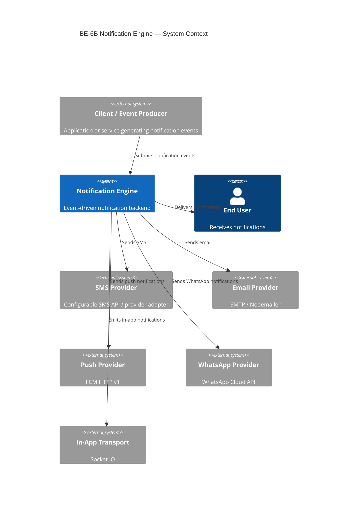
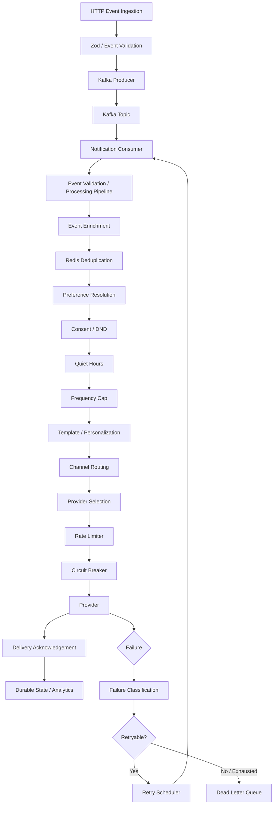
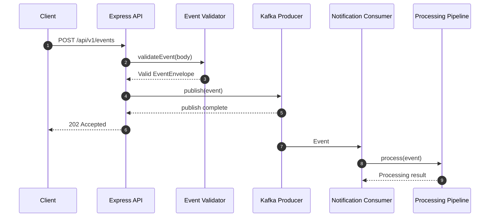
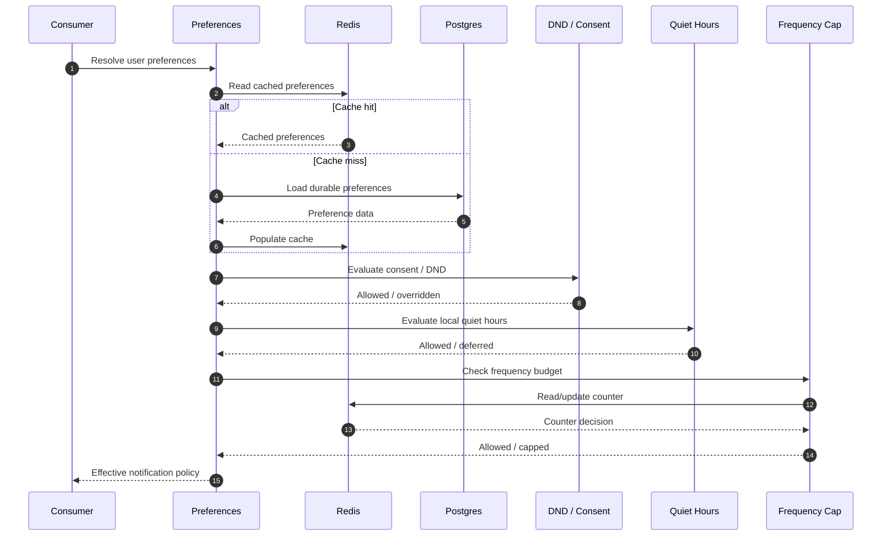
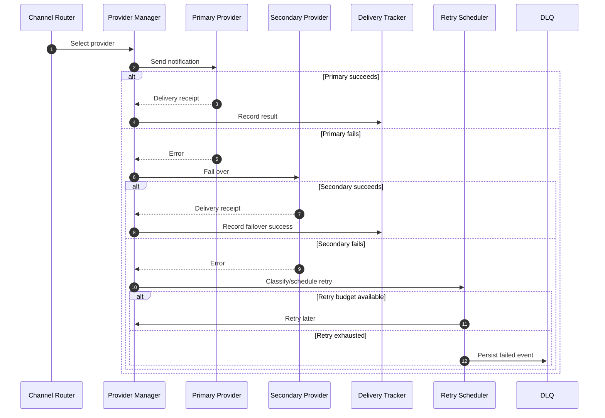
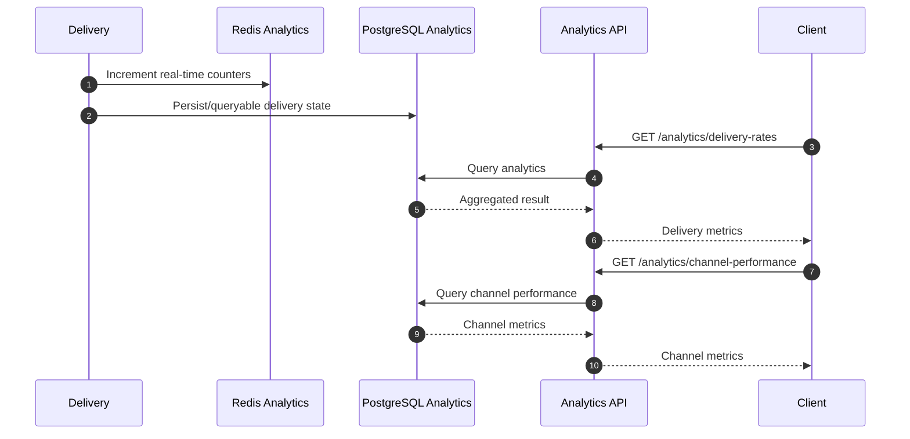

# BE-6B Notification Engine — Architecture

## 1. Purpose

This document describes the architecture represented by the current source tree and infrastructure configuration of the **BE-6B Notification Engine**.

The system is an event-driven notification backend. It accepts typed notification events, publishes them to Kafka, processes them asynchronously, applies user preferences and compliance rules, renders localized content, selects a delivery channel/provider, records delivery outcomes, and routes recoverable failures through retry/DLQ processing.

The implementation also exposes operational APIs, health checks, Prometheus-compatible metrics, and analytics endpoints.

---

## 2. Architecture principles

The implementation is organized around these principles:

- **Asynchronous processing:** notification events are published to Kafka before downstream processing.
- **At-least-once processing:** Kafka consumer processing uses explicit consumer lifecycle/offset handling.
- **Idempotency:** Redis-backed deduplication protects against repeated event processing.
- **Policy before delivery:** preferences, consent/DND, quiet hours, frequency caps, and regulatory overrides are evaluated before channel selection.
- **Provider isolation:** each delivery provider implements a common provider contract.
- **Resilience:** provider rate limiting, circuit breakers, health checks, and failover reduce the impact of downstream provider failures.
- **Priority-aware recovery:** critical/high/normal/low events have different retry budgets and delays.
- **Durable state:** PostgreSQL stores notification, state-history, preference, template, consent, provider, and DLQ data.
- **Low-latency state:** Redis handles caching, deduplication, counters, rate limits, and real-time analytics state.
- **Operational visibility:** structured logs, correlation IDs, health endpoints, analytics APIs, and Prometheus metrics are first-class application concerns.

---

## 3. System context



---

## 4. Runtime container architecture

```mermaid
C4Container
title BE-6B Notification Engine — Containers

System_Ext(client, "Client / Event Producer", "Generates notification events")

System_Boundary(engine, "Notification Engine") {
  Container(api, "HTTP API", "Express + TypeScript", "Event ingestion, preferences, DLQ, analytics, health and metrics")
  Container(consumer, "Notification Consumer", "KafkaJS + TypeScript", "Consumes and processes notification events")
  Container(eventPipeline, "Event Processing Pipeline", "TypeScript", "Validation, enrichment, deduplication and routing preparation")
  Container(preferences, "Preference / Compliance Services", "TypeScript + Redis", "Preferences, consent, DND, quiet hours and frequency caps")
  Container(template, "Template Subsystem", "Handlebars + TypeScript", "Localization and personalization")
  Container(router, "Delivery Routing", "TypeScript", "Channel scoring, regulatory override and provider selection")
  Container(delivery, "Delivery Providers", "TypeScript adapters", "SMS, email, push, WhatsApp and in-app delivery")
  Container(retry, "Retry / DLQ", "TypeScript + PostgreSQL + Redis", "Retry scheduling, failure classification and DLQ management")
  Container(analytics, "Analytics", "PostgreSQL + Redis + Prometheus", "Delivery analytics and real-time counters")
  ContainerDb(postgres, "PostgreSQL 15", "Relational database", "Durable application state")
  ContainerDb(redis, "Redis 7", "In-memory data store", "Cache, deduplication, counters and limits")
  ContainerQueue(kafka, "Kafka", "Confluent Kafka 7.8", "Primary event backbone")
  ContainerQueue(rabbit, "RabbitMQ 3.12", "Message broker", "Provisioned supporting queue infrastructure")
}

Rel(client, api, "POST /api/v1/events")
Rel(api, kafka, "Publishes validated events")
Rel(kafka, consumer, "Delivers events")
Rel(consumer, eventPipeline, "Processes event")
Rel(eventPipeline, preferences, "Resolves policies")
Rel(preferences, redis, "Reads/writes cached state")
Rel(preferences, postgres, "Reads durable preference/consent state")
Rel(eventPipeline, template, "Requests rendered notification")
Rel(template, postgres, "Loads persisted templates")
Rel(eventPipeline, router, "Requests delivery decision")
Rel(router, delivery, "Selects delivery channel/provider")
Rel(delivery, postgres, "Persists delivery state")
Rel(delivery, redis, "Uses provider/limit state")
Rel(delivery, retry, "Reports failures")
Rel(retry, postgres, "Persists DLQ/state")
Rel(retry, redis, "Schedules/caches retry state")
Rel(analytics, postgres, "Queries durable analytics data")
Rel(analytics, redis, "Reads real-time counters")
Rel(api, analytics, "Serves analytics endpoints")
Rel(api, retry, "Serves DLQ management")
```



### Important current-state note

RabbitMQ is provisioned in Docker Compose and documented as supporting queue infrastructure. The current application bootstrap does not instantiate a RabbitMQ client; Kafka is the active event backbone in the current implementation.

---

## 5. Internal component flow



---

## 6. Event lifecycle

1. A client submits an event to `POST /api/v1/events`.
2. The API validates the event envelope and payload.
3. A correlation-aware logger records the accepted event.
4. The validated event is published to Kafka.
5. The notification consumer receives the event.
6. The processing pipeline validates/processes the event.
7. User/context information is enriched.
8. Redis is checked for duplicate processing.
9. Effective user preferences are resolved.
10. Consent and DND rules are evaluated.
11. Quiet hours are evaluated using the user's timezone/preferences.
12. Frequency caps are evaluated.
13. A localized template is selected.
14. Personalization data is applied.
15. Channel routing evaluates regulatory overrides and channel scores.
16. A provider is selected.
17. Provider rate limiting and circuit-breaking checks run.
18. The provider is called.
19. Delivery state/acknowledgement is recorded.
20. Analytics counters and durable analytics data are updated.
21. Retryable failures are scheduled using the priority-aware retry policy.
22. Exhausted/unrecoverable failures are persisted to the DLQ.

---

## 7. Event ingestion sequence



---

## 8. Preference and compliance sequence



---

## 9. Delivery, failover and retry sequence



---

## 10. Analytics sequence



---

## 11. Delivery channels

The current routing model supports five channels:

| Channel  | Provider implementation     |
| -------- | --------------------------- |
| SMS      | `SmsProvider`               |
| Email    | `EmailProvider`             |
| Push     | `PushProvider`              |
| WhatsApp | `WhatsAppProvider`          |
| In-app   | `InAppProvider` + Socket.IO |

Provider wrappers add rate limiting and circuit-breaker execution around provider operations.

The application bootstrap currently initializes providers in **test mode**, allowing the complete routing/delivery pipeline to be exercised without sending real external notifications.

The provider classes also contain non-test integration paths for configurable external services.

---

## 12. Routing model

`ChannelRoutingEngine` evaluates available channels and first checks for regulatory overrides.

If a regulatory channel is required, that channel is selected directly.

Otherwise, `ChannelScoring` ranks candidates using the available routing context, including:

- user preferences
- channel eligibility
- delivery characteristics
- cost/budget information

The routing result records the selected channel, candidate scores, and the reason for the decision.

---

## 13. Retry architecture

The retry policy is priority-aware.

| Priority | Maximum retries | Base delay | Maximum delay | Jitter |
| -------- | --------------: | ---------: | ------------: | -----: |
| Critical |              10 |     500 ms |          60 s |    1 s |
| High     |               5 |        1 s |         5 min |    1 s |
| Normal   |               3 |        5 s |        30 min |    1 s |
| Low      |               2 |       30 s |           2 h |    1 s |

The effective delay is exponential backoff plus bounded jitter, capped by the priority-specific maximum.

Retry processing also uses retry budgets and failure classification.

---

## 14. Dead-letter queue architecture

DLQ processing contains:

- failure classification
- PostgreSQL persistence
- retry processing
- retry-count tracking
- status tracking
- alert monitoring
- dashboard repository/service
- HTTP dashboard endpoints

Current DLQ API:

```text
GET  /dlq
POST /dlq/:id/retry
POST /dlq/:id/discard
```

Supported DLQ classifications include:

```text
transient
permanent
configuration
```

Supported states include:

```text
pending
processing
resolved
```

---

## 15. Data architecture

### PostgreSQL

The primary migration creates:

- `users`
- `notifications`
- `notification_state_log`
- `user_preferences`
- `templates`
- `delivery_providers`
- `consent_records`
- `dead_letter_queue`

### Notification partitioning

`notifications` is partitioned by `created_at` using PostgreSQL range partitions.

The migration creates monthly partitions for the current and following year plus a default partition.

### Indexing

The schema includes indexes for:

- user + notification creation time
- notification status + creation time
- event type + creation time
- notification state history
- active template lookup
- active provider lookup
- active users
- consent lookup
- DLQ status + retry time

Analytics adds a BRIN index on `notification_state_log.created_at`.

### Redis

Redis is used for:

- event idempotency/deduplication
- preference caching
- frequency counters
- API rate limits
- provider state
- circuit-breaker state
- analytics counters

---

## 16. API surface

The Express application currently exposes:

### Ingestion

```text
POST /api/v1/events
```

Returns `202 Accepted` when a validated event has been accepted for Kafka publication.

### Preferences

```text
GET /users/:id/preferences
PUT /users/:id/preferences
```

Preference updates use a strict Zod schema.

### DLQ

```text
GET /dlq
POST /dlq/:id/retry
POST /dlq/:id/discard
```

### Analytics

```text
GET /analytics/delivery-rates
GET /analytics/channel-performance
GET /analytics/opt-out-trends
GET /analytics/costs
```

### Health and operations

```text
GET /live
GET /ready
GET /health
GET /health/providers
GET /metrics
GET /api-docs
```

The full request/response contract is maintained in `backend/docs/openapi.yaml`.

---

## 17. Observability architecture

### Structured logging

Pino provides structured JSON logs with configurable log level and optional pretty output.

### Correlation IDs

The event envelope includes `correlation_id`.

Correlation-aware child loggers attach the same identifier to processing logs.

### Request logging

HTTP request completion logs include:

- method
- path
- status code
- duration
- remote address

### Health

The application distinguishes:

- liveness
- readiness
- overall health
- provider health

Readiness checks include PostgreSQL, Redis, Kafka, and the configured RabbitMQ readiness callback.

### Metrics

Prometheus-compatible metrics are exposed through `/metrics`.

Alert rules are maintained in:

```text
backend/src/config/prometheus-alerts.yml
```

---

## 18. Security architecture

Current controls include:

- `.env` ignored by Git
- `.env.example` for configuration documentation
- strict Zod validation
- strict preference payload validation
- parameterized Knex queries
- Express rate limiting
- Helmet
- CORS
- environment-based provider credentials
- dependency auditing
- Snyk validation during development
- secret-pattern review

The global API limiter is configured separately from the event-ingestion limiter.

The event ingestion endpoint has a dedicated per-minute limiter, while operational endpoints such as liveness and metrics are excluded from the global public limiter.

---

## 19. Failure handling

Application errors are classified into categories used by the delivery/retry layer, including transient, permanent, validation, and configuration-oriented failure handling.

The processing model is:

```text
Provider/API failure
       |
       v
Failure classification
       |
       +--> Validation/permanent/configuration
       |          |
       |          v
       |         DLQ
       |
       +--> Transient
                  |
                  v
            Retry budget
                  |
          +-------+-------+
          |               |
       Available        Exhausted
          |               |
          v               v
       Retry             DLQ
```

---

## 20. Graceful shutdown

The application handles:

```text
SIGINT
SIGTERM
```

Shutdown sequence:

1. prevent duplicate shutdown execution
2. log shutdown start
3. stop accepting HTTP work
4. disconnect notification consumer
5. disconnect notification producer
6. close Socket.IO
7. quit Redis
8. destroy PostgreSQL connections
9. enforce a shutdown timeout
10. report completion/failure

---

## 21. Scaling model

### API

The HTTP API is stateless at the application layer and can be replicated behind a load balancer.

### Kafka

Kafka consumer groups provide the basis for horizontal consumer scaling.

Consumer concurrency is configurable through:

```text
KAFKA_CONSUMER_CONCURRENCY
```

### PostgreSQL

The application uses a PostgreSQL connection pool with configurable minimum/maximum connections and acquire/idle timeouts.

### Redis

Redis offloads high-frequency state operations from PostgreSQL and supports low-latency counters and deduplication.

### Providers

Provider wrappers isolate external provider limits from the rest of the application through:

- provider rate limits
- circuit breakers
- health checks
- failover

---

## 22. Load testing

The repository contains k6 scenarios for:

```text
backend/scripts/k6/normal-load.js
backend/scripts/k6/peak-load.js
backend/scripts/k6/market-crash.js
backend/scripts/k6/part-b-450k.js
```

The scenarios represent:

- normal traffic
- peak traffic
- high-volume market-crash traffic
- a sustained 450,000-request workload

The load-testing work also introduced:

- a real event-ingestion API path
- Kafka producer/consumer wiring
- PostgreSQL pooling
- configurable Kafka consumer concurrency

---

## 23. Docker architecture

The root Docker Compose file provisions:

```text
app
postgres
redis
kafka
rabbitmq
```

All infrastructure services have health checks.

The application waits for healthy PostgreSQL, Redis, Kafka, and RabbitMQ dependencies.

Resource limits are defined for the services.

The production Dockerfile uses three stages:

```text
builder
  |
  v
production-deps
  |
  v
production runtime
```

The runtime container runs as the non-root `node` user.

---

## 24. CI architecture

`.github/workflows/ci.yml` runs on pushes and pull requests targeting:

```text
main
master
```

The CI job performs:

```text
Checkout
   |
Node.js 22
   |
npm ci
   |
npm audit --audit-level=high
   |
npm run lint
   |
npm test -- --coverage
   |
Coverage artifact
   |
npm run build
```

---

## 25. Test architecture

The current repository contains 51 test files across source modules and integration/E2E suites.

Testing covers:

- event validation
- event ingestion
- Kafka integration
- preferences
- compliance
- DND
- consent
- quiet hours
- frequency caps
- template rendering
- personalization
- localization
- provider behavior
- provider rate limiting
- provider circuit breakers
- provider failover
- channel routing
- delivery acknowledgements
- retry policies
- retry budgets
- DLQ processing
- analytics
- health checks
- application APIs
- end-to-end notification flows

The repository also contains an E2E suite covering:

1. event ingestion → processing → routing → delivery → tracking
2. mandatory delivery for a DND-registered user
3. preference changes during delivery
4. provider failover

---

## 26. Architecture decisions

Existing ADRs:

- `backend/docs/001-event-backbone.md`
- `backend/docs/002-postgresql-redis.md`
- `backend/docs/003-rabbitmq-supporting-queues.md`

These documents capture the major messaging and storage decisions made during the project.

---

## 27. Current-state versus assignment-target structure

The assignment specifies a target repository layout with dedicated directories for notifications, API, templates, preferences, compliance, analytics, delivery, and database modules.

The current implementation uses a slightly different but functional organization:

```text
backend/src/
├── analytics/
├── compliance/
├── config/
├── delivery/
│   ├── acknowledgement/
│   ├── circuit-breaker/
│   ├── dlq/
│   ├── failover/
│   ├── health/
│   ├── providers/
│   ├── registry/
│   ├── retry/
│   └── routing/
├── errors/
├── events/
│   ├── consumer/
│   ├── deduplication/
│   ├── enrichment/
│   ├── factory/
│   ├── producer/
│   ├── routing/
│   ├── schemas/
│   └── types/
├── infrastructure/
│   ├── kafka/
│   ├── postgres/
│   ├── redis/
│   └── socket/
├── logging/
├── middleware/
├── preferences/
└── template/
    ├── catalog/
    ├── engine/
    ├── localisation/
    ├── personalisation/
    ├── registry/
    └── validation/
```

This reflects the source code currently present in the reviewed repository and should be treated as the implementation source of truth.

---

## 28. Summary

The system is centered on a Kafka-driven asynchronous notification pipeline with PostgreSQL as the durable state store and Redis as the low-latency state layer.

The major processing path is:

```text
Event
  → Validate
  → Publish to Kafka
  → Consume
  → Enrich
  → Deduplicate
  → Resolve preferences
  → Enforce compliance
  → Check quiet hours/frequency
  → Render localized template
  → Route channel
  → Select provider
  → Rate-limit/circuit-break
  → Deliver
  → Track
  → Analyze
  → Retry or DLQ on failure
```

The architecture is intentionally modular so that new event types, channels, providers, templates, compliance rules, and analytics dimensions can be added without rewriting the event ingestion backbone.
